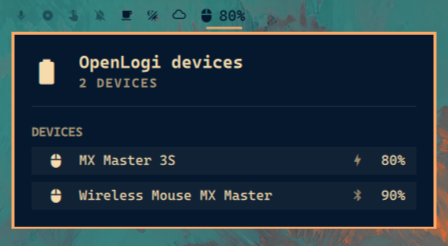

# OpenLogi Battery Indicator for Omarchy

_An Omarchy battery widget using the OpenLogi CLI._

`mwz.openlogi-battery` is a read-only Omarchy bar plugin for battery levels
reported by [OpenLogi](https://github.com/AprilNEA/OpenLogi).



The bar shows the lowest readable battery percentage among connected devices.
Click it to open an alphabetically sorted list of connected devices and their
battery levels. Mouse, trackball, keyboard, numpad, touchpad, headset, gamepad
and joystick device types receive matching Nerd Font glyphs; unknown types use a
battery glyph. Each popup row also shows how the device is connected: Logi Bolt,
Unifying and Lightspeed receivers, Bluetooth-direct, or wired USB. Hover over
the connection glyph for its label.

## Requirements

- Omarchy 4 with the Quickshell-based shell plugin system
- `openlogi` available on `PATH`
- A Nerd Font configured for the Omarchy bar (the Omarchy default works)

Install and configure OpenLogi by following its
[official Linux instructions](https://github.com/AprilNEA/OpenLogi#installation),
then confirm that the CLI is available and can inspect your devices:

```sh
openlogi --version
openlogi list
```

The plugin does not install OpenLogi or write device settings. It calls
`openlogi list` at startup, every five minutes, and whenever its popup opens.

## Install

Install from the Git repository and enable the bar widget:

```sh
omarchy plugin add https://github.com/mwz/openlogi-battery-omarchy --enable
```

Omarchy places the widget in the right section by default. It can be moved with
the normal bar command:

```sh
omarchy bar move mwz.openlogi-battery --section center
```

## Update

Update a Git-managed installation to the latest revision:

```sh
omarchy plugin update mwz.openlogi-battery
```

## Remove

Remove the plugin from Omarchy:

```sh
omarchy plugin remove mwz.openlogi-battery
```

This does not remove OpenLogi or change its configuration.

## Privacy and security

The plugin runs only `openlogi list` through the local shell. Its output is kept
in the Omarchy shell process's memory and is not written to disk or sent over
the network by this plugin. The plugin does not request elevated privileges.

## Develop and verify

From this repository:

```sh
./tests/run
```

Set `OMARCHY_PATH` when testing against an Omarchy source checkout somewhere
other than `/usr/share/omarchy`.

The OpenLogi CLI currently exposes human-readable rather than structured list
output. Parsing is isolated in `Model.js` so a future machine-readable command
can replace it without changing the UI. Its `transports=` field describes the
connections supported by the model, not necessarily the live connection; the
plugin therefore combines the inventory parent, direct-device slot and current
product ID instead of treating the first listed transport as active.

This is an independent community plugin. It is not affiliated with or endorsed
by OpenLogi, Logitech or Omarchy.

## Licence

MIT
